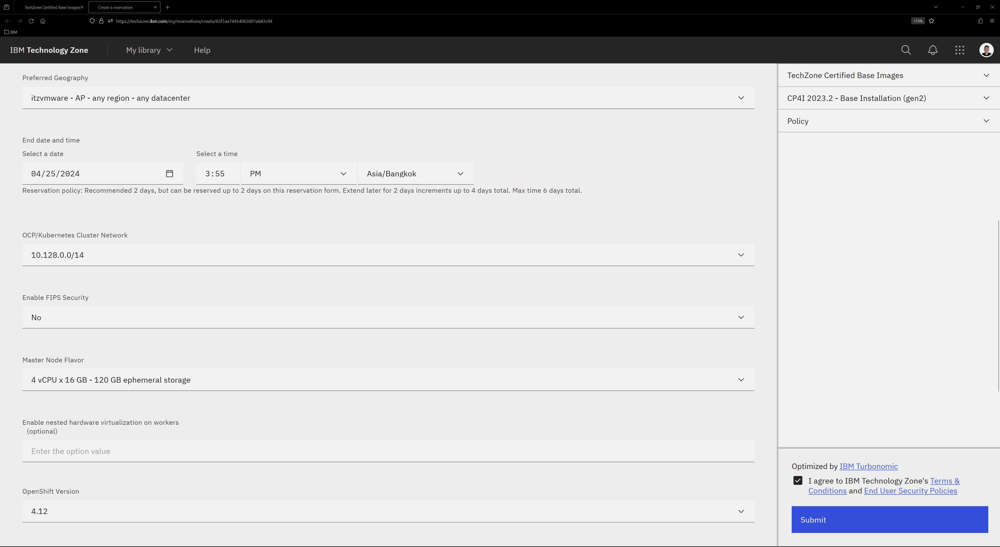
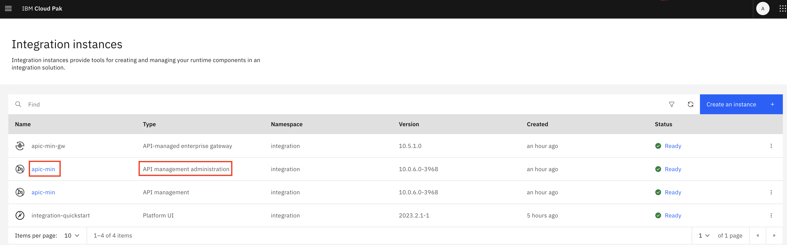

**APIC Workshop Lab 0 - Get Started**

In this lab, you will get started with Lab environment and create  
a Provider Organization.

In this tutorial, you will explore the following capabilities:

-   Access the Lab environment.

-   Access the Cloud Pak Console. 

- 	Access the API Connect Cloud Manager Console.

-   Configure an Email server for notifications.

-   Create a Provider Organization.

 APIC Workshop Series
====================================================================================================================================================================

The APIC Workshop Series is a hands-on workshop with lab exercises that
walk you through designing, publishing, and securing APIs. This workshop
is for API developers, architects, and line of business people who want
to create a successful API strategy. There are 9 labs and each is 30
minutes long. Make sure you choose enough time in your reservation to
get through all the labs! 

[NOTE: ]**[This demo environment contains a
full API Connect installation in Cloud Pak for Integration. The login
information to the APIC cluster will be sent in a separate email when
you reserve the instance. Use Google Chrome, Firefox or Microsoft Edge
to access the cluster using the credentials supplied. Make sure you
login using Common Services registry.]**

[Lab 0 : Get Started](https://github.com/ibm-ecosystem-lab/APICv10/tree/main/instructions/Lab0/index.md)

[Lab 1 : Create and Secure an API to Proxy an Existing REST Web
service](https://github.com/ibm-ecosystem-lab/APICv10/tree/main/instructions/Lab1/index.md)

[Lab 2 : The Developer Portal
Experience](https://github.com/ibm-ecosystem-lab/APICv10/tree/main/instructions/Lab2/index.md)

[Lab 3 : Add OAuth Security to your
API](https://github.com/ibm-ecosystem-lab/APICv10/tree/main/instructions/Lab3/index.md)

[Lab 4 : Use Lifecycle Controls to Version Your
API](https://github.com/ibm-ecosystem-lab/APICv10/tree/main/instructions/Lab4/index.md)

[Lab 5: Advanced API
Assembly](https://github.com/ibm-ecosystem-lab/APICv10/tree/main/instructions/Lab5/index.md)

[Lab 6: Working with API
Products](https://github.com/ibm-ecosystem-lab/APICv10/tree/main/instructions/Lab6/index.md)

[Lab 7: The Consumer
Experience](https://github.com/ibm-ecosystem-lab/APICv10/tree/main/instructions/Lab7/index.md)

[Lab 8: Create and test GraphQL Proxy
API](https://github.com/ibm-ecosystem-lab/APICv10/tree/main/instructions/Lab8/index.md)

[Lab 9: Creating GraphQL API with StepZen](https://github.com/ibm-ecosystem-lab/APICv10/tree/main/instructions/Lab9/index.md)

Reserving your own lab environments for API Connect
===========================================================================================

1. Navigate to [IBM Technology Zone](https://techzone.ibm.com) and log in using your IBM id. You will be greeted with the IBM Technology Zone home page that looks like the screenshot below.

   

2. Go to TechZone **Certified Base Images > Pre-Installed Software**. Scroll down until you find a tile entry named **CP4I 202x - Base Installation**. Click on the tile or the blue **Reserve** button.

   

3. At the reservation type selection screen, select **Reserve now** for the single environment reservation options. You may choose to schedule an instance at a later time for future use.

   

4. At the reservation details screen, you can name the reservation to your liking. Select the **Practice / Self-Education** option for the reservation purpose. You will be given access to the environment for a maximum duration of 6 days. If you have a Salesforce opportunity ID, you may choose the **Customer Demo** purpose to get access for a maximum duration of 4 weeks.

   

5. For the **Preferred Geography**, select **AP**. Leave the other settings to the default values. Click the checkbox to agree to the IBM TechZone Terms and Conditions. Then, click the blue **Submit** button.

   

6. You will see a confirmation screen that looks like the screenshot below. A confirmation email will also be sent to you when your reservation is ready.

   

Login to Red Hat OCP Console
===========================================================================================
1. Open a browser window and login to the Red Hat OCP Console with the url and credentials provided by the instructor. Choose Login with kube:admin

   

2. Navigate to Pipelines > PipelineRuns. Verify whether pipeline run is successful.

   

3. Go to latest successful PipelineRun > Logs > output-usage to retrieve the IBM Cloud Pak login credentials.

   

Login to API Connect Cloud Manager
===========================================================================================

1. Open a browser window and login to the Cloud Pak Console with the url and login credentials that you retrieved from the output-usage in previous step.

	
	
2. 	From the Home screen of the cloud pak console, click on the **Integration instances**.
	
	
	
3. You will see instances of API Gateway, API Manager and API management Administration (Cloud Manager).
	Click on [[apic-min]] at API management administration to access the Cloud manager console.

	
	
4. Log in to the Cloud Manager console using the **Common Services User Registry** user registry (if prompted).

	
	
5. You will be able to see cloud manager console home screen as shown below.

	
	
 Configure an Email Server
===========================================================================================
	
1. Click Resources icon in the left navigation menu or Manage Resources tile.

2. Cick Notifications and then Click Dummy mail server.

	
	
3. For the Address, enter `smtp-relay.sendinblue.com`
	Port, enter `587`
	Authenticate user, enter `apic.vest@gmail.com`
	Authenticate password will be provided by the instructor as shown below.
	
		
	
4. Scroll down and click **Test email**.
   Enter your email address and click send email. 	
	
		
	
	Make sure that the email is sent successfully and click **Save**.
	
 Configure sender email address
===========================================================================================

1. Click on admin in the top navigation and select My Account.

		

2. Set the email address `<Your email address>` and Click **Save**.	

		

 Create a Provider Organization
===========================================================================================

1. Click on Provider Organization icon in the left navigation menu OR 
   Click on Manage Organizations tile from the Cloud Manager console Home.
   
2. Click [[Add-\>Create organization]] to create the provider organization.
   
   

3. For the Title, enter `VEST`
   Select [[Common services user registry]] for user registry.
   Type `admin` for the existing username.
   Click **Create**
   
      

7. Provider Organization should be created successfully as shown below.   

         

 Summary
=============================================================

You completed the APIC Workshop Lab 0 - Get Started. 
Throughout the tutorial, you explored the key takeaways:

-   Access the Lab environment.

-   Access the Cloud Pak Console. 

- 	Access the API Connect Cloud Manager Console.

-   Configure an Email server for notifications.

-   Create a Provider Organization.

Continue the APIC Workshop! Go to [APIC Workshop Lab 1 - Create and Secure an API](https://github.com/ibm-ecosystem-lab/APICv10/tree/main/instructions/Lab1) to
learn how to create and secure a new API using API Connect.

[def]: images/ocp_console_login_page.png