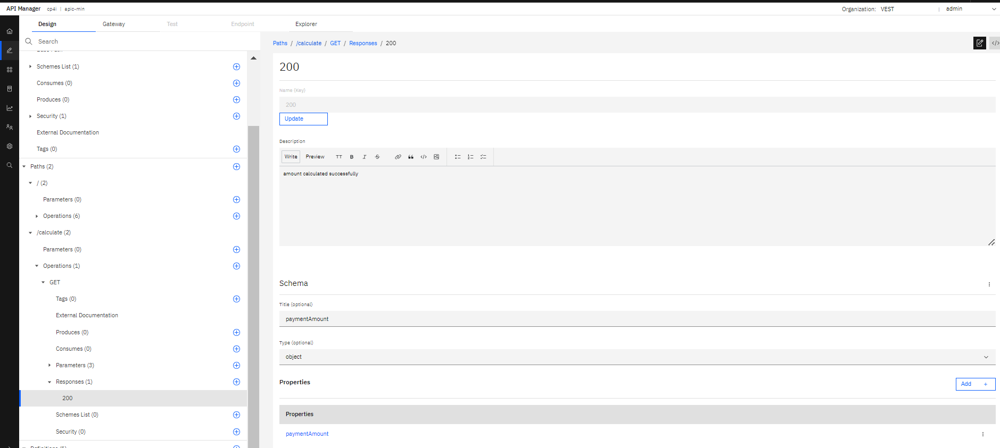
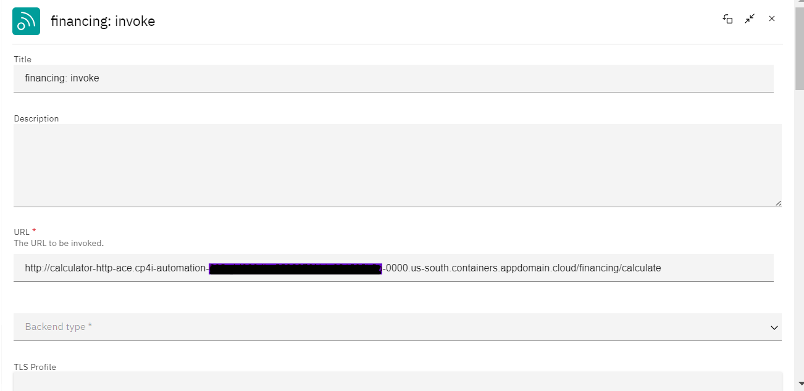
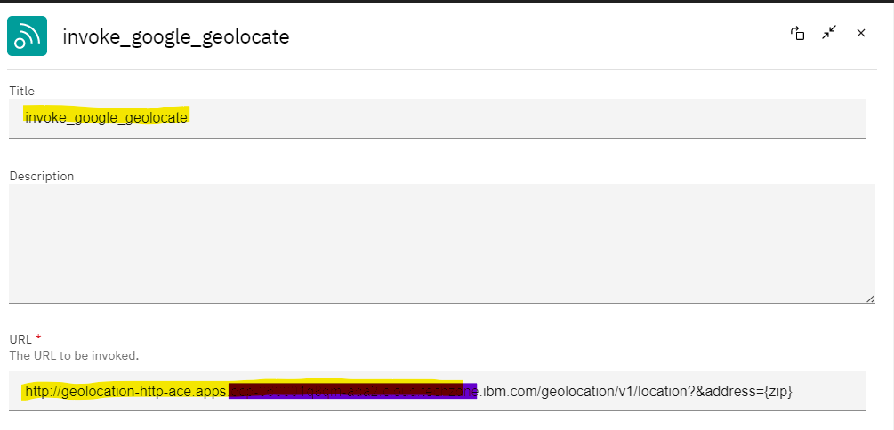

**APIC Workshop Lab 5 - Advanced API Assembly**

In the previous labs, you have been working with an API that acts as a
pass-through to a microservice application.

Think IBM wishes to provide APIs that
offer financing and shipping logistics to consumer applications. Your
goal is to utilize existing enterprise and public assets to create these
API offerings.

In this tutorial, you will explore the following key capabilities:

-   Create a new API, including object definitions and paths.

-   Configure an API to access an existing SOAP service.

-   Import an existing API from an OpenAPI definition document (a.k.a
    Swagger).

-   Map data retrieved from multiple API calls into an aggregate
    response.

-   Use GatewayScript directly within an API assembly.

APIC Workshop Series
===================================================================================================================================================================================================================================

The APIC Workshop Series is a hands-on workshop with lab exercises that
walk you through designing, publishing, and securing APIs. This workshop
is for API developers, architects, and line of business people who want
to create a successful API strategy. There are 9 labs and each is 30
minutes long. Make sure you choose enough time in your reservation to
get through all the labs! 

[NOTE: ]**[This demo environment contains a
full API Connect installation in Cloud Pak for Integration. The login
information to the APIC cluster will be sent in a separate email when
you reserve the instance. Use Google Chrome, Firefox or Microsoft Edge
to access the cluster using the credentials supplied. Make sure you
login using Common Services registry.]**

[Lab 0 : Get Started](https://github.com/ibm-ecosystem-lab/APICv10/tree/main/instructions/Lab0)

[Lab 1 : Create and Secure an API to Proxy an Existing REST Web
service](https://github.com/ibm-ecosystem-lab/APICv10/tree/main/instructions/Lab1)

[Lab 2 : The Developer Portal
Experience](https://github.com/ibm-ecosystem-lab/APICv10/tree/main/instructions/Lab2)

[Lab 3 : Add OAuth Security to your
API](https://github.com/ibm-ecosystem-lab/APICv10/tree/main/instructions/Lab3)

[Lab 4 : Use Lifecycle Controls to Version Your
API](https://github.com/ibm-ecosystem-lab/APICv10/tree/main/instructions/Lab4)

[Lab 5: Advanced API
Assembly](https://github.com/ibm-ecosystem-lab/APICv10/tree/main/instructions/Lab5)

[Lab 6: Working with API
Products](https://github.com/ibm-ecosystem-lab/APICv10/tree/main/instructions/Lab6)

[Lab 7: The Consumer
Experience](https://github.com/ibm-ecosystem-lab/APICv10/tree/main/instructions/Lab7)

[Lab 8: Create and test GraphQL Proxy
API](https://github.com/ibm-ecosystem-lab/APICv10/tree/main/instructions/Lab8)

[Lab 9: Creating GraphQL API with StepZen](https://github.com/ibm-ecosystem-lab/APICv10/tree/main/instructions/Lab9)

Prerequisites: Labs 1-4

 Create and Define the Financing API (REST to SOAP)
=========================================================================================================

Think IBM wants to give its customers the ability to calculate financing
payments. There is already a legacy SOAP-based application which will do
the calculation, but it should be exposed to consumers as a modern
RESTful API. In this section, you will create a new OpenAPI definition
for the financing API.

1. From the left navigation menu,
  click **[Develop.]**

2. Click **[Add]** and
  choose **[API]**.

    

3. Select **[New OpenAPI]** and click [[Next.]]

    

4. Fill in the form for **Create New OpenAPI** with the following values: 

    Title: `financing`

    Name: `financing`

    Base Path: `/financing`

    Version: `1.0.0`

    Click **Next**

    

5.  Leave all default values and click [[Next. ]]API
    Connect will generate a new OpenAPI definition for the financing API and
    provide a summary with the performed activities.

    

6.  Click  **[Edit API ]** to customize the API.

7.  Create the model definition for the new API. These definitions are
    used in a few places. Their primary role is to serve as documentation in
    the developer portal on expected input & output parameters and would also be
    used for data mapping actions.
    Click **[Definitions]** from the API
    Designer menu on the left. Then,
    click **[Add]** to create a new definition.

9. Enter `paymentAmount` for **[Name]** and
    set the definition **[Type]** 
    to **[object]**.
    
	

10.  Click **[Add]** in
    the **[Properties]** section    

11. Edit the **property values** using the following values:

    **Property Name: paymentAmount**

    **Type: number**

    **Description: Monthly payment amount**

    The page will look like this:

        

11. Click [[Paths]] in
    the navigation menu on the left. Then
    click **[Add]** to create a new path.

    

12. The Path screen is loaded. Edit the [[Path name]] to be **[/calculate]** and click Create. 
	**[Note:]** [Recall that our Base
    Path for this API is \`financing\`. This new path will be appended to
    the base, creating a final path of /financing/calculate.]

13. Click [[Add]] in
    the Operations section to define the operation to support under the
    path.

    

14. From the **[Add Operation]** menu,
    select the **[Get]** operation and then
    click **[Create]**. 

    

15. You will be redirected to the main API Editor to continue.

    

16. Scroll down to the Parameters section of **GET** operation within the operation config.
	This defines the input to the API request. Since
    this is a GET request, you will add the required request parameters to
    the query component of the URI.
    Click [[Add]] in the [[Parameters]] section.	
	
    You are actually going to need three total parameters for this
    operation, so go ahead to add the parameters and set the values as below:

```
  **Required**   **Name**   **Located In**   **Type**   **Description**
  -------------- ---------- ---------------- ---------- --------------------------
  yes            amount     Query            float      amount to finance
  yes            duration   Query            int 32     length of term in months
  yes            rate       Query            float      interest rate

```
  Once you have entered the values, the screen will look like this:

  

17. Delete any existing response e.g. 200 (if exists).
	Click **Add** in
    the **[Response]** section.
    Enter `200` for **STATUS CODE**.
	For **DESCRIPTION** enter `amount calculated successfully`
	Click Create.
	
18. Set the schema for the response. Enter `paymentAmount` for **[Title]** and
    set the definition **[Type]** 
    to **[object]** under **Schema** Section.
    
	

20.  Click **[Add]** in
    the **[Properties]** section    

21. Edit the **property values** using the following values:

    **Property Name: paymentAmount**

    **Type: number**

    **Description: Monthly payment amount**

    The page will look like this:

   
   
    Click **Create** to go back to the main API Editor.
	
   

22. Click [[Save]] to
    save the API definition.

    

 Map the API to a Service WSDL
====================================================================================

Import the legacy Financing SOAP service WSDL and map it to the RESTful
API definition.

 Attach a Service WSDL
-----------------------------------------------------------------------------------------------------------------------------------------

1.  Click **Gateway** tab in the top navigation and select the **[Target Services]** option
    in the left column menu palette for the **[financing 1.0.0]** API

2.  Click **[Add]** to import the web
    service from the legacy financing service.

    

3.  Download the [calculate.wsdl](https://raw.githubusercontent.com/ibm-ecosystem-lab/APICv10/main/calculate.wsdl) and 
	then Drag/Drop or upload the downloaded [[calculate.wsdl]] from your machine.

    

    You will get a success message and the service included in the WSDL
    will be displayed.

    

5. Select **[financingService.]** Then click **[Create]**.

6. Click on the imported financingService. Search and edit the `target-url` with the endpoint provided by the Instructor.

 
 Build the Financing API Assembly
-----------------------------------------------------------------------------------------------------------------------------------------

1. Click [[Policies]] to
    access the assembly editor.

    

2. In the processing pipeline, mouse over
    the [[invoke]] policy
    and click
    the [[trashcan]] icon
    to delete it.

    

3. Scroll down to the bottom of the policy menu and drag and drop
    the **[financing web service operations]** to processing pipeline.

    

4. Now you are going to modify the input and output map policy for
    mapping your REST API into SOAP.

    

5. In order to consume a SOAP-based service from your REST-based API,
    you need to map the query parameter inputs that were previously defined
    as part of the GET /calculate operation to a SOAP payload. To do so,
    click the [[financing input]] map
    policy on our pipeline to open the map editor.

    [[Tip: Click on the \`+\` icon to make the editor window fill the
    screen.]]

10. Click on
    the [[pencil icon]] in
    the [[Input column]].

    

11. Click [[Add parameters for operation\...]] and
    select the **[GET Calculate operation]**.

    

    The Map editor will automatically pull in the request parameters
    that you defined earlier.
	
12. Click **[Done]** to return to the map
    editor.

13. For each of the Input query parameters, map them to their
    respective SOAP Output elements.

    To map from an input field to an output field, click the circle next
    to the source element once, then click the circle next to the target
    element. A line will be drawn between the two, indicating a mapping from
    the source to the target.

   

14. Click [[\`X\`]] in
    the map editor to return to the policy pipeline.

15. Click
    the [[invoke policy]] to
    open its editor.

16. The SOAP service URL has already been set for you during the
    service import when we create the API.

    

17. Click [[\`X\`]] to
    return to the policy pipeline.

18. After the Financing Web Service is invoked, you need to map the
    SOAP response into a JSON object.

    You already defined the response object
    called [[paymentAmount]].
    To do the map, click the **[financing output]** map policy on the pipeline to
    open the map editor.

19. Click the [[pencil icon]] to set the output object schema.

20. Click the **[Add outputs for operation\...]** option and select
    the [[GET /calculate operation]].

21. Set the [[Content type]] configuration
    option
    to [[application/json]], Set the [[Definition]] as shown below,
    and then
    click [[Done]] to
    return to the map editor.

    

22. Click the [[circle next to the paymentAmount source
    element]] once,
    then click the [[circle next to the target
    element]].
    A line will be drawn between the two, indicating a mapping from the
    source to the target.

    

23. Click [[\`X\`]] in
    the map editor to return to the policy pipeline.

24. Click [[Save]] the API definition.

25. Click **[Develop]** in the navigation
    menu to return to the list of APIs and Products in your system.

 Import Logistics API
===========================================================================

In this lab section, we will be adding a new API called logistics which
will provide helper services around calculating shipping rates and
locating nearby stores. Rather than require you to build the entire API
from scratch again, you will see how you can import and modify an
existing OpenAPI definition.

 Import the OpenAPI Definition
-------------------------------------------------------------------------------------------------------------------------------------------------

1.  Click **[Add]** and
    select **[API.]**  

    

2.  From the Create API wizard, select [[Import: Existing
    OpenAPI]].
    Then click [[Next]].  
	
	

3.  You will need logistics.yaml file for this step. From another browser window download the file using this link
    [logistics.yaml](https://raw.githubusercontent.com/ibm-ecosystem-lab/APICv10/main/logistics.yaml)

    Drag/Drop or Browse the downloaded logistics.yaml file in the [[Import from file]] window.

    

4.  Click [[Next]] in
    the confirmation window.

5.  Click [[Next]] one
    more time [[without selecting the option Activate
    API]] since
    we still need to make some updates.

6.  Click [[Edit
    API]] in
    the [[Summary]] page
    to go to the API editor.
	
7. Go to Gateway tab and Click on Properties. 

8. Edit the `shipping_svc_url` property value with the Endpoint provided by the Instructor.

9. Click on Catalog Properties and select sandbox.

10. Edit the `shipping_svc_url` property value under `Property Overrides` section, with the Endpoint provided by the Instructor.

11. Save the changes.

 Configure payload to be stored in Analytics
---------------------------------------------------------------------------------------------------------------------------------------------------------------

1.  From the Gateway menu, search and select [[Activity
    Log]].
    In
    the [[Success Content]] drop-down,
    select [[payload]].
    A pop up window will be displayed, asking to enable buffering.
    Click [[Continue]].

    

2.  Set the [[Error Content]] drop-down
    to [[activity]].
    Click [[Save]].

    

 Create an Orchestration Assembly
=======================================================================================

The logistics API provides resources for calculating shipping costs and
locating the nearest store for pickup. In this section, you will
configure the assembly for the shipping calculation resource. Your API
assembly will call out to two separate shipping vendors and provide a
consolidated response back to the consumer.

 Create the Logistics API Assembly
-----------------------------------------------------------------------------------------------------------------------------------------------------

1.  Switch to
    the [[Policies]] view in Gateway tab
    and remove
    the [[invoke]] policy
    by hovering over it and selecting the [[trashcan
    icon]].

2.  Click and drag
    the [[Operation switch]] policy
    to flow pipeline in the right.

3.  The switch editor will open with a single case with case 0 created
    by default.

4.  Next to case 0, click **[search
    operations\...]** to show the drop-down
    list of available operations.

5.  Select
    the **[shipping.calc]** operation.

6.  Click the **[Add Case]** button to add a
    second case for
    the [[get.stores]] operation.

7.  Click **[X]** to close the operation
    switch configuration editor and then
    click [[Save]].
    You should see two new processing pipelines created on your
    \`operation-switch\` step - one for each case:

    

 

 Configure the `shipping.calc` Case
--------------------------------------------------------------------------------------------------------------------------------------------------------

This operation will end up invoking two separate back-end services to
acquire shipping rates for the respective companies, then utilize a map
action to combine the two separate responses back into a single,
consolidated message for our consumers.

1.  Add an [[invoke
    policy]] to
    the [[shipping.calc case]].

2.  Edit the **[invoke]** action with the
    following properties:

    -   Title:
        `invoke_xyz`

    -   URL: `$(shipping_svc_url)?company=xyz&from_zip=90210&to_zip={zip}`

    -   [[Stop on error: unchecked]]

    -   Response object variable (scroll to the bottom):
        `xyz_response`    
         

    -   **[Note: The  parameter provided here is a reference to the
        zip parameter defined as input to the operation. The
        portion of the URL will get replaced by the actual zip code
        provided by the API consumers. ]**

3.  Hover over
    the [[invoke\_xyz policy]] and
    click [[clone]] to
    add another invoke action:  

      

4.  Edit the new invoke policy with the following properties:

    -   Title:
        `invoke_cek`

    -   URL:
        `$(shipping_svc_url)?company=cek&from_zip=90210&to_zip={zip}`

    -   Response object variable:
        `cek_response`  

        

        

5.  Add
    a [[map policy]] after
    the last invoke and then click it to open the
    editor.    

6.  Click
    the [[pencil]] at
    the top of the Input column, then click on the [[Add
    input]] button.
    Enter the following input configuration:

    -   Context variable:
        `xyz_response.body`

    -   Name:
        `xyz`

    -   Content type:
        `application/json`

    -   Definition:
        `#/definitions/xyz_shipping_rsp`

7.  Click the [[Add
    input]] button
    again to add another input. Specify the following input
    configuration:

    -   Context variable:
        `cek_response.body`

    -   Name: `cek`

    -   Content type:
        `application/json`

    -   Definition:
        `#/definitions/cek_shipping_rsp`

8.  You now have two inputs assigned to the
    map policy:  

9.  Click [[Done]] to
    return to the editor.

10. Click the [[pencil
    icon]] at
    the top of
    the [[Output]] column
    and then click [[Add outputs for
    operation\...]] and
    choose
    the [[shipping.calc]] operation.

11. Set **[Content type]** to [[application/json]].

12. Click [[Done]] to
    return to the editor.

13. Complete the mapping. To map from an input field to an output field,
    click the circle next to the source element once, then click the
    circle next to the target element. A line will be drawn between the
    two, indicating a mapping from the source to the
    target. 

14. Click **X** to close the map editor. Your assembly policy for the
    shipping.calc operation is now complete.

    

15. Save your changes.

 Use GatewayScript in an Assembly
=======================================================================================

In this section, you will configure the assembly for the store locator
resource. You will use GatewayScript to modify the response to your
consumers, providing them a maps link to the nearest store location.

 Configure the `get.stores` Case
-----------------------------------------------------------------------------------------------------------------------------------------------------

This operation will call out to the Custom Geocode API to obtain
location information about the provided zip code, and will then utilize
a simple gatewayscript to modify the response and provide a formatted
Google Maps link.

1.  Add an invoke policy to
    the [[get.stores case]].  

2.  Edit the
    new [[invoke action]] with
    the following properties:

    -   Title:
        `invoke_google_geolocate`

    -   URL:
        Enter the GeoLocation endpoint provided by the Instructor.

    -   [[Stop on error:
        unchecked ]]

    -   Response object variable (scroll to the bottom):
        `google_geocode_response`    
          

3.  Click [[X]] to
    close the invoke editor.

4.  Add
    a [[gatewayscript policy]] with
    the following properties:

    -   **[Title:
        gws\_format\_maps\_link]**

    -   Copy the following GatewayScript snippet and paste it into the
        text area:

```
var apim = require('apim');
// Save the Google Geocode response body to variable
var mapsApiRsp = apim.getvariable('google_geocode_response.body');

// Get location attributes from geocode response body
var location = mapsApiRsp.results[0].geometry.location;

// Set up the response data object, concat the latitude and longitude
var rspObj = {"google_maps_link": "https://www.google.com/maps?q=" + location.lat + "," + location.lng};

// Save the output     
apim.setvariable('message.body', rspObj)

```

  

-   **[Note: Take a quick look at line 5. Notice how our gateway script
    file is reading the body portion of the google\_geocode\_response
    variable which was assigned to the output of the invoke
    action.]**

    Click [[X]] to
    close the gatewayscript editor.

    Your assembly for the \`logistics\` API will now include two separate
    operation policies:  

    

7.  **Save** your
    changes.  

8.  Click [[Develop]] in
    the navigation menu to return to the list of APIs and Products in
    your system.


 Summary
==============================================================

Congratulations! You have successfully configured two new API's with
advanced assemblies. Throughout the tutorial, you explored the key
takeaways:

-   Create a new API, including object definitions and paths.

-   Configure an API to access an existing SOAP service.

-   Import an existing API from an OpenAPI definition document (a.k.a
    Swagger).

-   Map data retrieved from multiple API calls into an aggregate
    response.

-   Use GatewayScript directly within an API assembly.

Continue with the APIC Workshop Series! Go
to [APIC Workshop Lab 6 - Working with API Products](https://github.com/ibm-ecosystem-lab/APICv10/tree/main/instructions/Lab6))] to
learn about bundling the API's into a Product and publishing it to the consumer portal.
