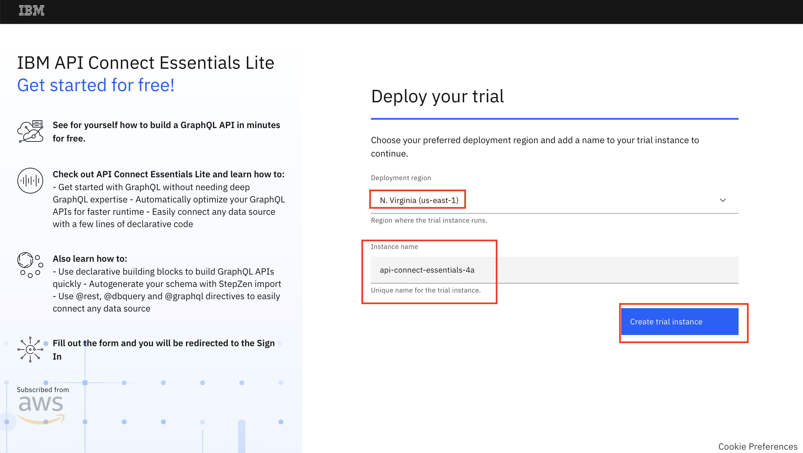

**APIC Workshop - Lab 9 -- Creating GraphQL API with API Connect Essentials**

In this lab, you will explore how you can quickly expose a REST backend as a GraphQL API. 

Using API Connect Essentials's CLI you can generate your GraphQL schema and resolvers for any backend data source (REST, Databases, GraphQL, Web3) with a few commands.

In this tutorial, you will do the following activities:

-   Sign-up for a free account in API Connect Essentials

-   Create GraphQL API for a REST backend

-   Deploy GraphQL API in API Connect Essentials

-   Test the GraphQL API

APIC Workshop Series
=======================================================================================================================================================================================================================================================================================================

The APIC Workshop Series is a hands-on workshop with lab exercises that
walk you through designing, publishing, and securing APIs. This workshop
is for API developers, architects, and line of business people who want
to create a successful API strategy. There are 9 labs and each is 30
minutes long. Make sure you choose enough time in your reservation to
get through all the labs! 

 

[NOTE: ]**[This demo environment contains a
full API Connect installation in Cloud Pak for Integration. The login
information to the APIC cluster will be sent in a separate email when
you reserve the instance. Use Google Chrome, Firefox or Microsoft Edge
to access the cluster using the credentials supplied. Make sure you
login using Common Services registry.]**

[Lab 0 : Get Started](https://github.com/ibm-ecosystem-lab/APICv10/tree/main/instructions/Lab0)

[Lab 1 : Create and Secure an API to Proxy an Existing REST Web
service](https://github.com/ibm-ecosystem-lab/APICv10/tree/main/instructions/Lab1)

[Lab 2 : The Developer Portal
Experience](https://github.com/ibm-ecosystem-lab/APICv10/tree/main/instructions/Lab2)

[Lab 3 : Add OAuth Security to your
API](https://github.com/ibm-ecosystem-lab/APICv10/tree/main/instructions/Lab3)

[Lab 4 : Use Lifecycle Controls to Version Your
API](https://github.com/ibm-ecosystem-lab/APICv10/tree/main/instructions/Lab4)

[Lab 5: Advanced API
Assembly](https://github.com/ibm-ecosystem-lab/APICv10/tree/main/instructions/Lab5)

[Lab 6: Working with API
Products](https://github.com/ibm-ecosystem-lab/APICv10/tree/main/instructions/Lab6)

[Lab 7: The Consumer
Experience](https://github.com/ibm-ecosystem-lab/APICv10/tree/main/instructions/Lab7)

[Lab 8: Create and test GraphQL Proxy
API](https://github.com/ibm-ecosystem-lab/APICv10/tree/main/instructions/Lab8)

[Lab 9: Creating GraphQL API with API Connect Essentials](https://github.com/ibm-ecosystem-lab/APICv10/tree/main/instructions/Lab9)

Prerequisites: Node.js and npm interface on your local machine. [Click here](https://docs.npmjs.com/downloading-and-installing-node-js-and-npm) for instructions.

 Create a GraphQL API with API Connect Essentials
=================================================================================

1.  Go to https://stepzen.com/developers and click on 'Start for Free' button in top right corner.

    

2.  Choose Log In to login using your IBMid. 

    

3.  For the deployment region choose N.Virginia (us-east-1). For instance name, choose any unique name and proceed to "Create trial instance".

    

    Make sure to verify the account by clicking on the link received in email. The link will redirect you to [IBM Saas Console](https://console.saas.ibm.com/dashboard/subscriptions)

    

4.  After you successfully sign-up, you will by default have subscription to free plan that allows you to host two endpoints and 300k calls/month. Click on "Launch" and it will redirect you to IBM API Connect Essentials Dashboard

    

    
    
    The 'Admin Key' displayed here is used to authenticate and perform the administrative operations, like deployment of APIs in the account; while the 'API Key' is used to authenticate API calls at runtime.

5.  Scroll down and click on the 'Getting Started' icon to go to the getting-started page.

    

6.  Click on the 'Shortcut: Convert REST to GraphQL'. Click "Next"

    

7.  We have hosted a REST backend that returns a list of user details. Instructor will provide the url of the service. Choose "GET" method and click "Next".

    

8.  You will see the steps required to setup your CLI for API Connect Essentials and connect to your API Connect Essentials account. Copy and Paste the command to your local terminal step by step.

    

    

9. Modify the Endpoint name to "api/getUsers" and leave the rest as default. Copy and Paste the command to your local terminal step by step.

     

     

10. In the Summary page you can proceed to click "Done". *It will take several minutes for the Endpoint to be shown as Active.

    

11.  Now go to API Connect Essentials dashboard <https://us-east-a.dashboard.ibm.stepzen.com/explorer>. You should see the GraphQL API endpoint there.
    
    
12.  From this playground you can test the hosted GraphQL API. You can modify the Query using Query Builder or the text editor provided in the console. After you make the changes just hit the "Execute query" button to see the changes reflected on the right hand section.

   

Summary
=================================================================================================================

Congratulations! You have successfully created a GraphQL API for a REST backend.

To learn more about API Connect Essentials, visit <https://www.ibm.com/docs/en/stepzen>

To learn more about Cloud Pak for Integration and API Life Cycle
Management, visit <https://www.ibm.com/cloud/cloud-pak-for-integration>

